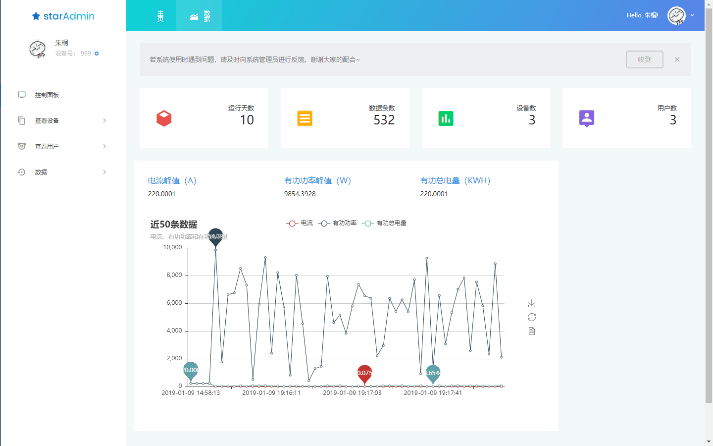
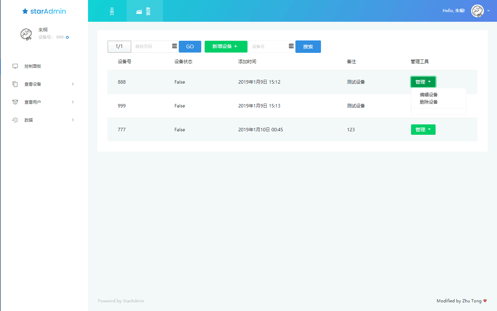
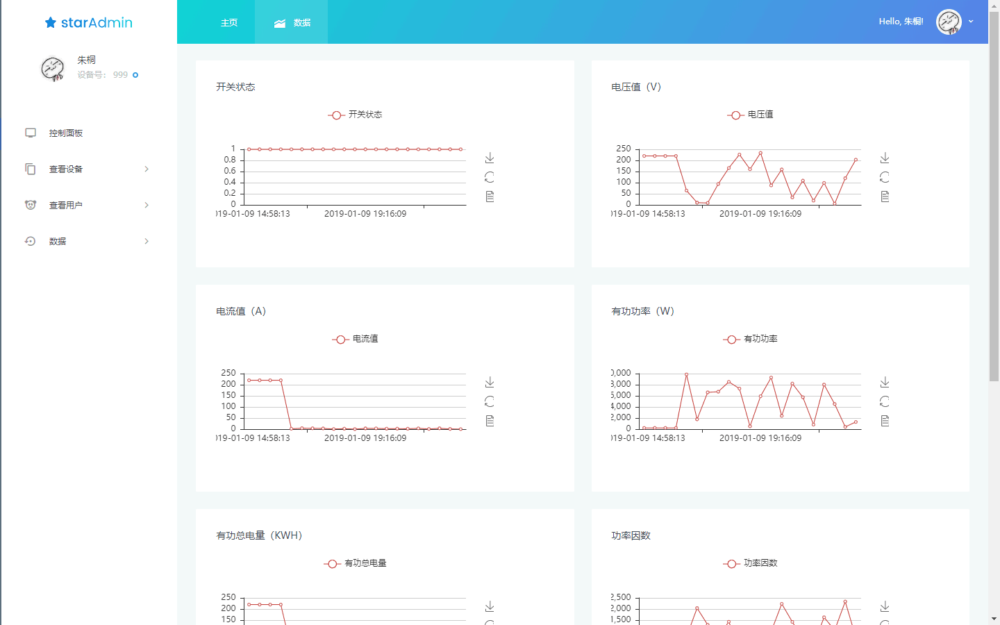

# lab-safety-iot

#### 介绍

一个实验室用电情况信息统计的物联网平台，可实现数据的实时上传和网页端查看的功能。

#### 软件架构

- Web
    - python==3.5.2
    - Django==2.1
    - pyecharts==0.1.5
    - uWSGI==2.0.17.1
    - pymongo==3.7.2
    - mongoengine==0.16.3
    - mysqlclient==1.3.14

- Database
    - MongoDB==3.6.9
    - MySQL==5.7.24 (optional)

#### 安装教程

1. 新建虚拟环境
2. `pip install -r requirements.txt`

#### 使用说明

1. 配置nginx，并重启服务
2. 配置uwsgi
3. `uwsgi --ini uwsgi.ini`
4. `python server.py # 启动socket服务端`

#### 数据上传格式

##### MCU连接服务器

帧头+机号+用户名+密码，如： START：（帧头）+001（3位机号）+13765031812(手机号作用户名)+123456（6位密码）：
`START:00113765031812123456`，均为ASCII格式。

##### 服务器响应

帧头+机号+结果+帧尾

如START（帧头）+001+OK+ACK（身份核验成功，MCU即可开机）`START:001OKACK`ASCII码
如START（帧头）+001+ER+ACK（身份核验失败）`START:001ERACK`ASCII码

##### 心跳包格式

服务器每隔一段时间会向MCU发送 机号+帧尾?，如：`001:HEART?`
MCU返回`HEART:001`

##### 数据格式

帧头 + 机号 + 数据（28个字节）+ 开关状态

开关状态：闭合（设备通电）为11；断开为：00
帧头：0X5A  0xA5  0X3C  0XC3
机号为：123
采集参数为：电压：220V  电流：1A 有功功率：220W 有功总电能：10KWH 功率因数：0.8  二氧化碳：1kg  频率：50HZ，开关：开 

则传输的数据格式为：
如：5A A5 3C C3  31 32 33  00 21 91 C0 00 00 27 10 00 21 91 C0 00 01 86 A0 00 00 03 20 00 00 27 10 00 00 13 88  11

其中：第一个00 21 91 C0   为电压220*10000转换为16进制数而来（单位为：0.0001，所以*10000），其余同理。

#### 联系作者

Spico (spico1026@gmail.com)
